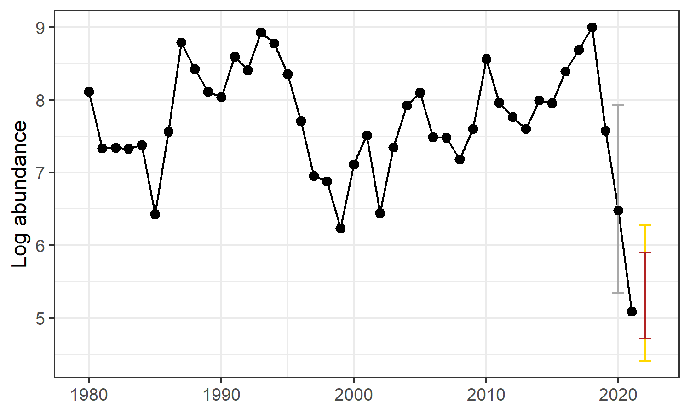

```{r echo=FALSE}
#knitr::include_graphics("FEATURED_IMAGE") #replace when image received
```
## An Unprecedented Decline in Snow Crab Abundance

Immature snow crab abundance estimates from the Bering Sea bottom trawl survey went from the highest level ever observed in 2018 to the lowest ever observed in 2021. The apparent collapse of the stock has had devastating impacts on the crab industry. The stock has been declared overfished and a rebuilding plan is being developed. 

The 2020 bottom trawl survey was canceled because of covid. The 2022 bottom trawl survey will be critical for confirming the results of the 2021 survey.

```{r echo=FALSE}
#knitr::include_graphics("ADDITIONAL_IMAGE") #replace when image received
```
## Understanding the Decline

NOAA Fisheries scientists are exploring the causes of the snow crab decline. Snow crab are an Arctic species that live in areas that experience seasonal ice cover in winter. They are largely absent from ecosystems without seasonal ice cover. One approach for understanding the decline is to treat it as a consequence of borealization. Borealization is the ecological process that occurs when Arctic ecosystems warm and lose their seasonal ice cover, and transition to  being subarctic systems that are ice free year-round. Borealization involves changes to all aspects of the ecosystem, including changes in the physical environment, the timing and nature of algae blooms that provide energy to the whole system, and the community of animals that are present in the system.

To better understand this process, NOAA Fisheries scientists have developed an index that combines physical and biological information to track the progress of borealization in the Bering Sea. This index successfully explains the decline of immature snow crab abundance in a simple statistical model. This model predicts the abundance of immature snow crab in a given year as the combined function of

1. abundance in the previous year; and
2. the value of the borealization index in the previous year (that is, how Arctic or subarctic conditions were in the previous year).

This model explains about 53% of the variability in snow crab abundance for the years 1980-2021, which is a strong relationship. It also demonstrates the negative consequences of borealization for snow crab.

```{r regression, echo=FALSE, fig.align='center'}

```

*The statistical effect of borealization on immature snow crab abundance, 1980-2021: the best estimate for the relationship (red line) with 80%, 90%, and 95% uncertainty (grey ribbons).* 

## Forecasting abundance

We already know two key pieces of information for 2021: the abundance of snow crab and the value of the borealization index. This allows us to use the model to forecast 2022 abundance before the survey data are available. For ecological forecasts to be useful, they should be publicly available, they should be transparent (that is, the model methods should be available for examination), and they should be made iteratively (they should be made repeatedly, with model methods updated and improved after every forecast round).

The model forecasts that 2022 immature snow crab abundance has an **80% chance** of falling **between 112 and 356 million crabs**, or 4.6%-14.8% of the 1980-2019 mean. The model also forecasts a 95% chance that immature abundance will fall **between 82 and 505 million crabs**, or 3.4%-21.0% of the 1980-2019 mean.

```{r, echo=FALSE, fig.align='center'}

```

*The 2022 forecast compared with past years’ immature snow crab abundance from the bottom trawl survey. The 80% probability range for the 2022 forecast is shown with the dark red error bars, and the 95% probability range is shown with the yellow error bars. The 2020 value was missing because of covid and is estimated here with a technique called multiple imputation. The gray error bars around that year indicate the uncertainty for the estimated value (± 2 standard deviations). Note that plotted values on the vertical index are log-transformed abundance. On this scale, a value of six indicates ten times more crab than a value of five, a value of seven indicates 100 times more crab than a value of five, and so on.*

## What's Useful About This Forecast?
```{r echo=FALSE}
#knitr::include_graphics("ADDITIONAL_IMAGE") #replace when image received
```
Climate change is having dramatic effects on the Bering Sea. During 2016-2020, Bering Sea temperatures were between three and five standard deviations (3.0° - 4.6° Fahrenheit) above the 1854-1949 mean. Responding to this change presents an outsized challenge to fisheries participants and fisheries managers.  
This forecast model gives us a tool for tracking the effects of climate change as they unfold. If the Bering temporarily reverts to a cooler state, the model could give scientists a tool for forecasting stock recovery as more Arctic conditions return. This forecast could also eventually be useful to stock assessment biologists who track possible future trajectories of the snow crab population. And developing a borealization index for other parts of the Bering Sea could help scientists predict fisheries outcomes as the Bering continues to warm and Arctic conditions retreat towards the Bering Strait.

Predicting the future from past conditions is always difficult, and there are many sources of uncertainty that might affect the accuracy of this forecast. For example, immature snow crab remain abundant in the Northern Bering Sea, and possible movements from that source area would result in a recovery of the Eastern Bering Sea population at a faster rate than predicted by this model. And scientists and stakeholders are very aware that we have few observations of the stock since the apparent collapse, and the need to estimate the 2020 value adds considerable uncertainty to these results.

Actual results from the 2022 survey will be published when they are available. The accuracy of the model will be evaluated continually, and the forecast method will be revised to help improve future forecasts.

## More Information

Github:  

\textcolor{blue}{https://github.com/mikelitzow/fish-FAR}

Zenodo:  

\textcolor{blue}{https://zenodo.org/record/5535032\#.YdSxfWjMJnI}  

Apps-Server?
